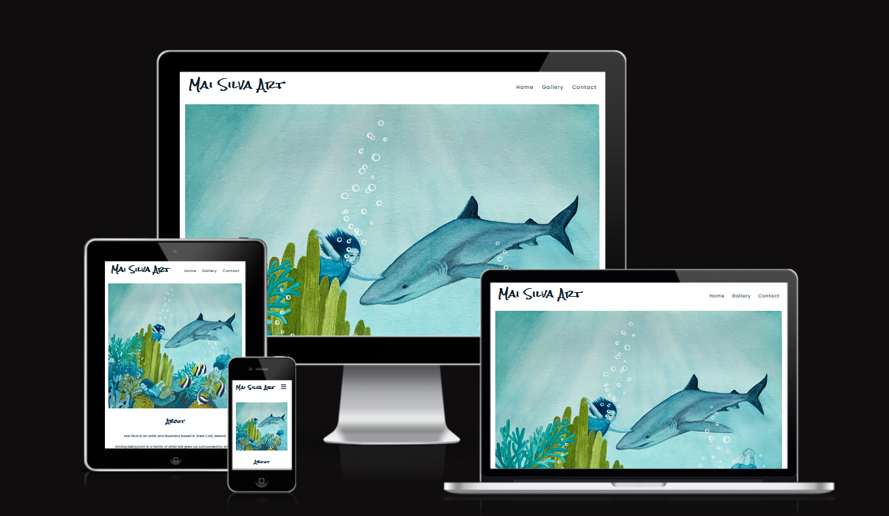
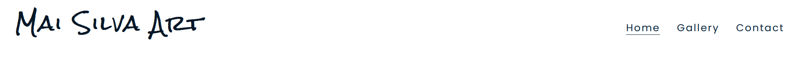
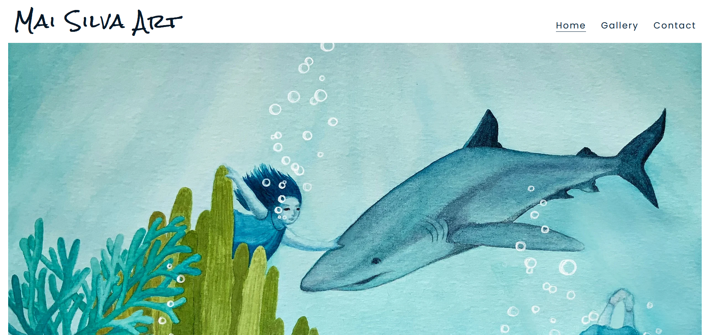
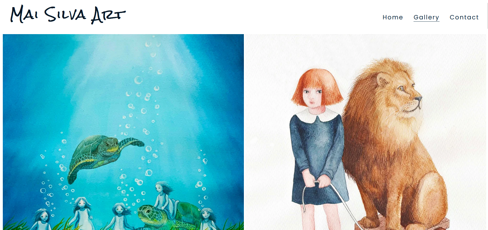
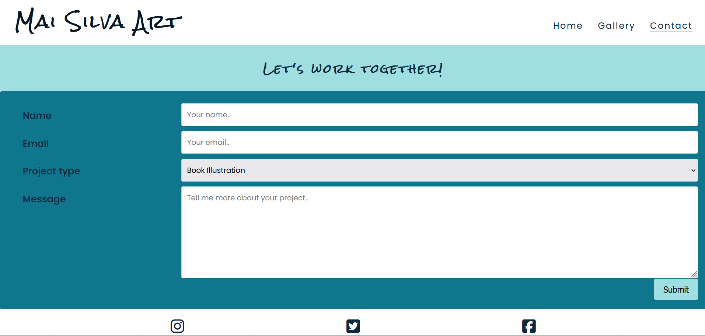
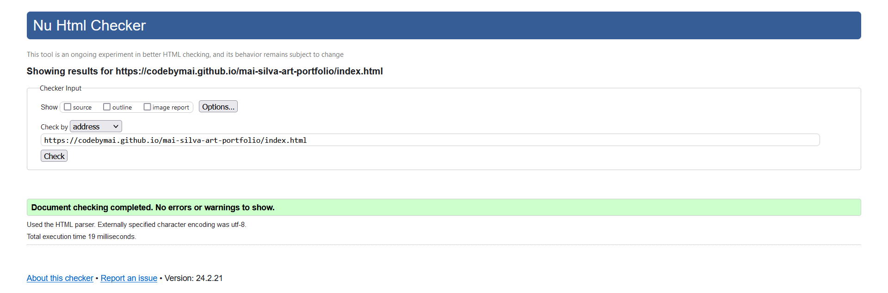
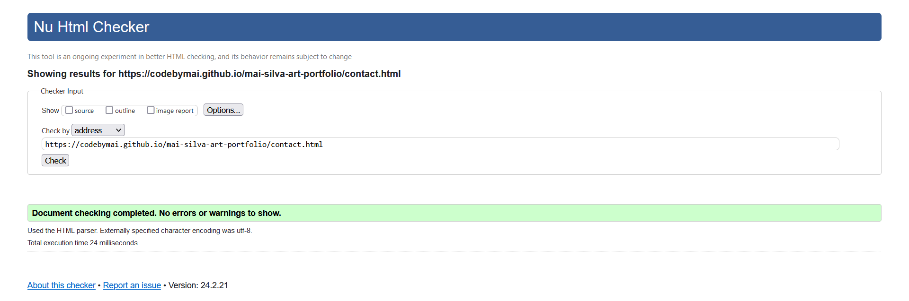
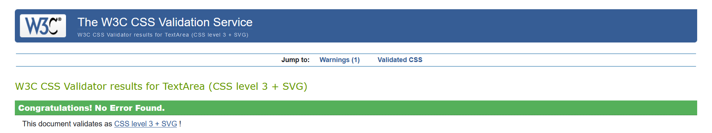

# Mai Silva Art 
MaiSilvaArt is the online portfolio website of the artist and illustrator Mai Silva. The primary goal of the website is to showcase Mai's artwork to potential professional customers in publishing industry.

## Demo

Link to the live site here: <https://codebymai.github.io/mai-silva-art-portfolio/>

---

# Table of contents

* [User Experience (UX)](#user-experience-ux)

* [Languages Used](#languages-used)

* [Design](#design)

* [Features](#features)

* [Testing](#testing)

* [Deployment](#deployment)

* [Solved Bugs](#solved-bugs)

* [Credits](#credits)
  
* [Acknowledgements](#acknowledgements)
  
---

# User Experience (UX)

Mai Silva Art website is designed to showcase the artwork, provide informations about the artist and her creative process as well as the contact informations. As the main purpose of the website is to create the space to showcase the artwork, the website is intentionally minimalistic in design in keeping with the art world standards.

At this stage the website is not intended to be used as a selling channel or self promotion tool.

The site was designed and developed mobile first. 

* Client Goals
   * For the artist the website is providing profesinal online space to showcase her work and open communication channels for future illustrative work. 
    
* Visitor Goals
    * For the users the website offers an introduction to the artist, her work and creative process and point of contact for professional inquieries.
 
---

### Languages Used

* HTML
* CSS

---

## Design

* Wireframes
![Wireframes] (assets/docs/wfmobile.png)
![Wireframes] (assets/docs/wfdesktop.png)

* Colour Scheme
Colour scheme was intentionally kept simple to complement the artworks rather than distract from them.

* Typography

The fonts Poppins and Rock Salt were imported from [Google Fonts](https://fonts.google.com/).

* Imagery

All images used throughout the website belong to the artist- Mai Silva.

* Icons

[Font awesome](https://fontawesome.com/icons)

---

## Features

### Existing Features

The website features a user-friendly interface with three pages(home, gallery and contact page).

All pages have a logo in the top left corner and navigation bar in the top right corner as well as footer on the bottom of the page.
Navigation bar is responsive on all screen sizes.

#### Navigation Bar

* Allows users to navigate easily.
* On hthe small screens navigation bar appears as a hamburger icon. Toggling feature was taken from the Love Running walk through project.
* Clicking on the logo returns the user to the home page.

#### Footer
Footer contains:
* The copyright information.
* Social media links. The links take the users to the home page of the social media platforms as the website doesn't have social media profiles yet.

#### Home Page

* The Home page features hero-image of one of the artworks.
* Below the artwork there is a section containing :
	* image from the studio;
	* basic information about the artist;
	* embeded Youtube video of the process;
As the artist was not able to provide suitable video at this stage, the embeded video of another artist serves as a placeholder - see credits for details.

#### Gallery

* The Gallery page features images of Mai Silva's artworks. 
* By showcasing the images in a single column on the mobile phone and tablet screens and two columnns on the laptops and desktops the user gets the opportunity to appreciate details of the artworks.
  

#### Contact Page

* Contact Form consists of two mandatory fields, dropdown choice field, optional message field and submit button.
* The form contains a validation, so the users can not submit the form without filling up the required input fields.
* The dropdown menu was included to make it clear to the users that the artist is interested in illustrative work rather than private commissions.

### Potential Future Updates and Features

* Converting logo to Scalable Vector Graphics for improved responsiveness.

* Customized 404 page.

* Lightbox gallery - introduction of this feature would allow the users to appreciate the artworks in more detail.

* Integrated store - potentially in the future the artist might want to start selling artprints through the website.

---

## Testing

The wbsite was manually tested to confirm it is responsive across a range of common devices.

### W3C Validator

W3C Markup Validator were used to validate each page of the project to ensure there were no syntax errors.

### W3C CSS Validator

CSS - No syntax errors were found using Jigsaw css validator.

### Accessibility

  * Semantic HTML.
  * Colour contrast.
  * Alt attributes to images.
  * Sans serif font.

The accessibility was confirmed by running it through lighthouse in devtools.

### Manual Testing User Stories

| User Story | Testing |
| ---------- | -------- |

| As a first time user I want to find the artist's social media profiles | The user can find links to the social media in the footer on any page of the website |
| As a first time user I want to see the artist's works | By clicking on the Gallery in the navigation bar the user is take to a gallery containing artworks |
| As a returning user I want contact the artist to discuss illustration project | By clicking on Contact amd filling the form the user is able to contact the artist |
| As a site owner I want to promote my artwork | By including social media links in the footer of the website I am giving the users option of following me across various social media platforms |

---

## Deployment 

### Deployment
The page was deployed to Github.

1. Log in (or sign up) to Github.
2. Navigate to the repository.
3. In Settings, under Code and Automation, select Pages.
4. From a branch under Source select Deploy.
5. Select the main branch

## Solved Bugs

After asking friends to test the Mai Silva Art portfolio following bugs were identified and fixed:

1. There was too much empty space under the hero image on mobile devices.
   * Changed hero image for mobile devices for a rectangular one.
2. On mobile devices text on About page was too close to the frame for reading comfort.
   * Fixed by adding padding.
3. Logo was wrapping on smaller mobile screens instead of remaining in one line.
   * Fixed by changing size of the font to percentage and adding media query for larger devices.   
   
---

## Credits

## Media

* [Font awesome](https://fontawesome.com/icons)
* [Iconmonstr](https://iconmonstr.com/?s=coffee)
* [Coolors](https://coolors.co/)
* [Google Fonts](https://fonts.google.com/)
* [Mockup Screenshot Generator](https://ui.dev/amiresponsive)

## Reference Material

* [Love Running Walkthrough project](https://learn.codeinstitute.net/ci_program/diplomainsoftwaredevelopmentecomm)
* [Love Running Walkthrough project readme template](https://github.com/Code-Institute-Solutions/readme-template)
* [W3 School](https://www.w3schools.com/howto/howto_css_responsive_form.asp)
* [Stackoverflow](https://stackoverflow.com/)
* [Yoast](https://yoast.com/how-to-make-youtube-videos-responsive/)

---

## Acknowledgements

* Mentor and Tutor suport at Code Institute.

