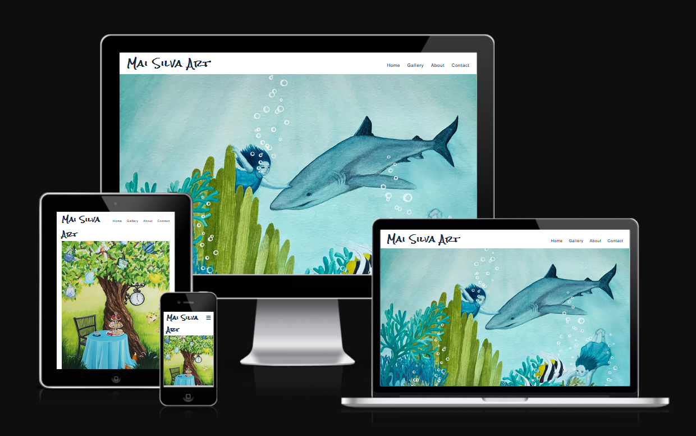
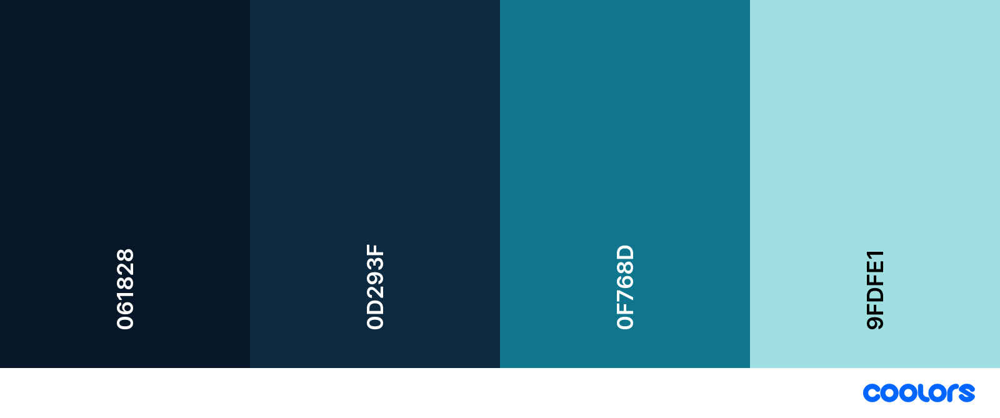
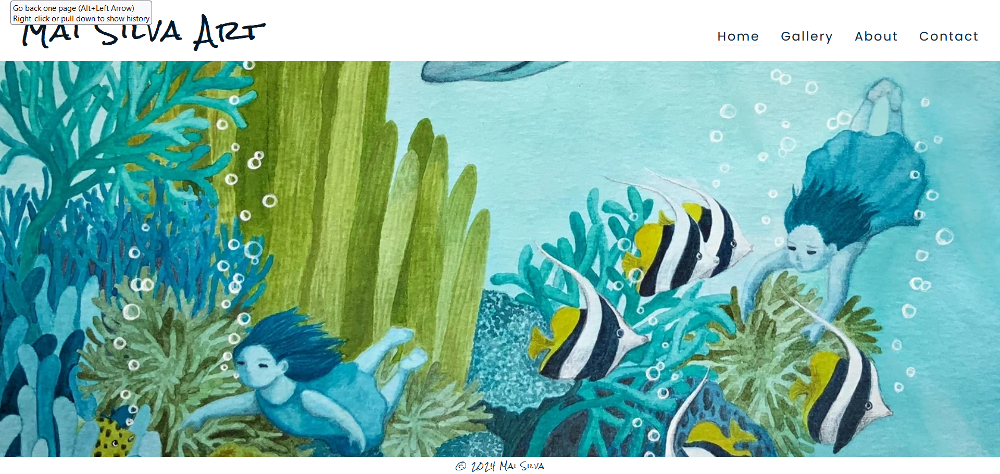
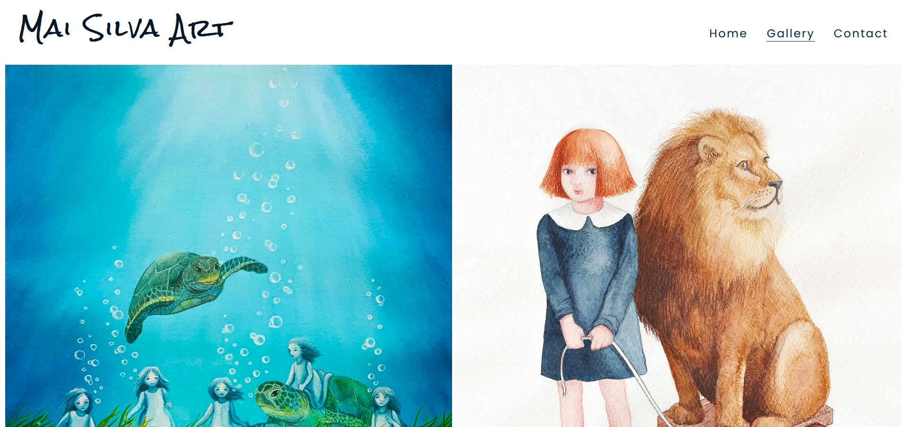
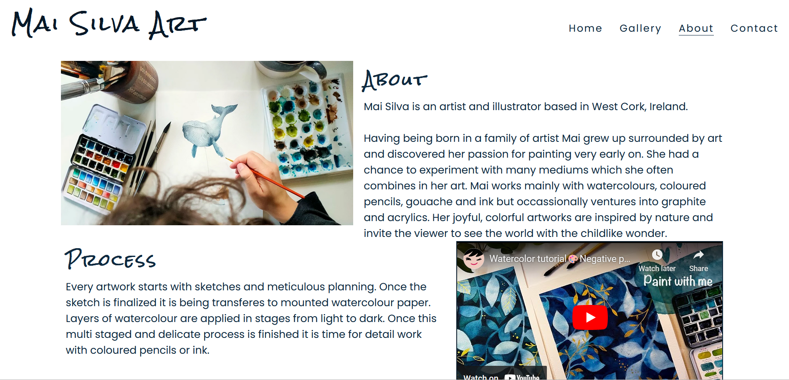
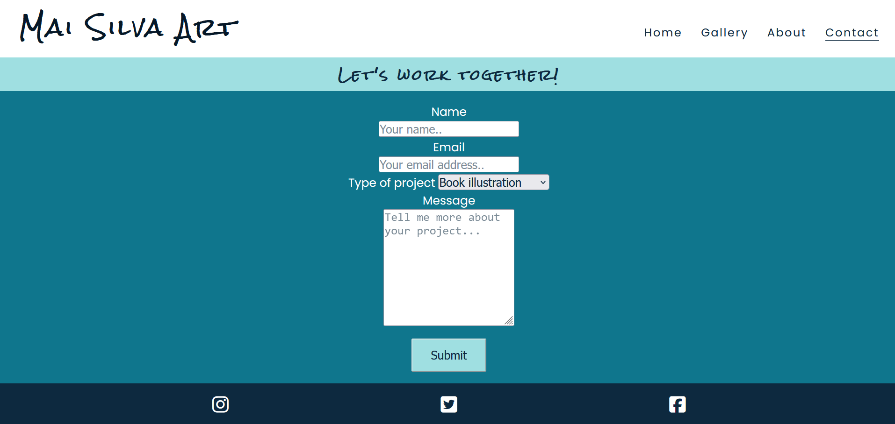

# Mai Silva Art 
MaiSilvaArt is the online portfolio website of the artist and illustrator Mai Silva. 

## Demo

Link to the live site here: <https://codebymai.github.io/mai-silva-art-portfolio/>

---

# Table of contents

* [User Experience (UX)](#user-experience-ux)

* [Languages Used](#languages-used)

* [Design](#design)

* [Features](#features)

* [Testing](#testing)

* [Deployment](#deployment)

* [Solved Bugs](#solved-bugs)

* [Credits](#credits)
  
* [Acknowledgements](#acknowledgements)
  
---

# User Experience (UX)

Mai Silva Art website is designed to showcase the artwork, provide informations about the artist and her creative process as well as the contact informations. As the main purpose of the website is to create the space to showcase the artwork, the website is intentionally minimalistic in design in keeping with the art world standards.

At this stage the website is not intended to be used as a selling channel or self promotion tool.

The site was designed and developed mobile first. 

* Client Goals
   * For the artist the website is providing profesinal online space to showcase her work and open communication channels for future illustrative work. 
    
* Visitor Goals
    * For the users the website offers an introduction to the artist, her work and creative process and point of contact for professional inquieries.
 
---

### Languages Used

* HTML
* CSS

---

## Design

* Wireframes
![Wireframes] (assets/docs/wfmobile.png)
![Wireframes] (assets/docs/wfdesktop.png)

* Colour Scheme
* 
Colour scheme was intentionally kept simple to not to distract from the artworks.

* Typography

The fonts Poppins and Rock Salt were imported from [Google Fonts](https://fonts.google.com/).

* Imagery

All images used throughout the website belong to the artist- Mai Silva.

* Icons

[Font awesome](https://fontawesome.com/icons)

---

## Features

### Existing Features

The website features a user-friendly interface with four pages(home, gallery, about and contact page).

All pages have a logo in the right top corner and navigation bar in the left top corner.
Footer contains copyright information.
Navigation bar is responsive on all screen sizes.

#### Navigation Bar

* allows users to navigate easily;
* on small screens navigation bar appears as a hamburger icon. Toggling feature was taken from the Love Running walk through project.
* clicking on the logo returns the user to the home page.
* 
![Navigation bar] (assets/docs/Header.png)

#### Home Page

* The Home page features hero-image of one of the artworks. Mobile devices and desktops showcase a different image to avoid cropping of the artwork.

#### Gallery
* The Gallery page features images of Mai Silva artworks in single column on mobile phone screens, two columnns on tablets and three columns on laptops and desktops.
  

#### About

* The about page features:
	* image from the studio;
	* basic information about the artist;
	* embeded Youtube video of the process; ( As the artist was not able to provide suitable video at this stage of the process the embeded video of another artist serves as a placeholder - see credits for details.)

#### Contact Page

* Contact Form consists of two mandatory fields, dropdown choice field, optional message field and submit button.
* The form contains a validation, so the users can not submit a form without filling up all the required input fields.

### Potential Future Features

* Lightbox gallery.
* Integrated store.

### Accessibility

  * Semantic HTML.
  * Colour contrast.
  * Alt attributes to images.
  * Sans serif font.

The accessibility was confirmed by running it through lighthouse in devtools.

---

## Testing

### W3C Validator

W3C Markup Validator were used to validate each page of the project to ensure there were no syntax errors.

[W3C Validator](https://validator.w3.org/)

### W3C CSS Validator

CSS - No syntax errors were found using Jigsaw css validator.

[Jigsaw Validator](https://jigsaw.w3.org/css-validator/)

---

## Deployment 

### Deployment
* the page was deployed to Github.

1. Log in (or sign up) to Github.
2. Find the repository for this project, P01-Allotment-garden.
3. Click on the Settings link.
4. Click on the Pages link in the left-hand side navigation bar.
5. In the Source section, choose main from the drop-down select branch menu. Select Root from the drop-down select folder menu.
6. Click Save. Your live Github Pages site is now deployed at the URL shown.

## Solved Bugs

Following bugs were identified and fixed:

1. There was too much empty space under the hero image on mobile devices.
   * Changed hero image for mobile devices for a rectangular one.
2. On mobile devices text on About page was too close to the frame for reading comfort.
   * Fixed by adding padding.
   
---

## Credits

## Media

* [Font awesome](https://fontawesome.com/icons)
* [Iconmonstr](https://iconmonstr.com/?s=coffee)
* [Coolors](https://coolors.co/)
* [Google Fonts](https://fonts.google.com/)
* [Mockup Screenshot Generator](https://ui.dev/amiresponsive)
* [Negin Armon Youtube tutorial] (https://www.youtube.com/watch?v=mw_ybyFaqd0&t=8s) used as a placeholder for the future video content from the artist.

## Reference Material

* [Love Running Walkthrough project](https://learn.codeinstitute.net/ci_program/diplomainsoftwaredevelopmentecomm)
* [Love Running Walkthrough project readme template](https://github.com/Code-Institute-Solutions/readme-template)
* [W3 School](https://www.w3schools.com/)
* [Stackoverflow - Back to top button](https://stackoverflow.com/search?q=back+to+top+button)

---

## Acknowledgements

<<<<<<< HEAD
* Mentor and Tutor suport at Code Institute.
=======
* Mentor and Tutor suport at Code Institute.
>>>>>>> 6ab849e76a62a83f8ee229ef49f3da0494e584a4
